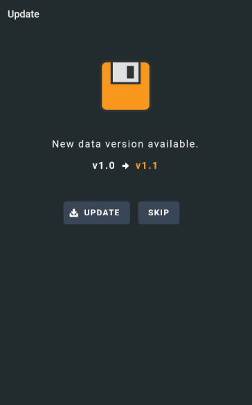

# POC: Ionic/Capacitor download data from remote source

Proof of concept application to check a service for the latest version of applicaiton data. Then to download that data and use it until a new set of data becomes available.

## Notes
It was the intention to swap out which version of the data access service to inject based on a check inside a DI injector. This seems slower than having a singleton figure it out once. See `createDataService`.

It was easier to save the file to the device using the `cordova-plugin-file` packages than then `Filesystem` from capacitor. Though the opposite is true for reading.

The cordova plugin requires native device URLs for reading files. Filesystem has a nicer system that asks you to specify the type of directory, Cache, Data etc. _It is important to specify the encoding for files._

## Issues

cordova-plugin-file makes it easy to save files, but not easy to read them having to switch to native device urls.

The capacitor plugin appears to make it easier to be agnostic between devices for reading files and directories but makes it more difficult to save new files.

## Links
https://cordova.apache.org/docs/en/latest/reference/cordova-plugin-file/#readFile

https://capacitor.ionicframework.com/docs/apis/filesystem/#type-468